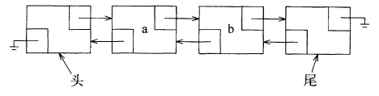
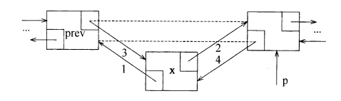

## LinkedList简介

* LinkedList 是一个继承于 AbstractSequentialList 的双向链表。它也可以被当作堆栈、队列或双端队列进行操作。
* LinkedList 实现 List 接口，能对它进行队列操作。
* LinkedList 实现 Deque 接口，即能将 LinkedList 当作双端队列使用。
* LinkedList 实现了Cloneable接口，即覆盖了函数 clone()，能克隆。
* LinkedList 实现 java.io.Serializable 接口，这意味着 LinkedList 支持序列化，能通过序列化去传输。
* LinkedList 是非同步的。

LinkedList相对于 ArrayList 来说，是可以快速添加，删除元素，ArrayList 添加删除元素的话需移动数组元素，可能还需要考虑到扩容数组长度。


> 本文转自[LinkedList源码分析（基于JDK8）](https://blog.csdn.net/fighterandknight/article/details/61476335)，本人仅在自己的理解上做了些许的修改。  

## LinkedList属性

LinkedList本身的 的属性比较少，主要有三个，一个是 size，表名当前有多少个节点；一个是 first 代表第一个节点；一个是 last 代表最后一个节点。

``` java
public class LinkedList<E>
    extends AbstractSequentialList<E>
    implements List<E>, Deque<E>, Cloneable, java.io.Serializable
{
    transient int size = 0;

    /**
     * 指向第一个节点的指针。
     */
    transient Node<E> first;

    /**
     * 指向最后一个节点的指针。
     */
    transient Node<E> last;
}
```

## LinkedList 构造方法

### 无参构造方法

默认构造方法是空的，什么都没做，表示初始化的时候 size 为 0，first 和 last 的节点都为空：

``` java
public LinkedList() {
}
```

### 带Collection对象的构造函数

构造一个包含指定 Collection 的元素的列表,下面是执行逻辑：

1. 使用 this() 调用默认的无参构造函数。
2. 调用 addAll() 方法，传入当前的节点个数 size，此时 size 为 0，并将 collection 对象传递进去
3. 检查 index 有没有数组越界的嫌疑
4. 将 collection 转换成数组对象 a
5. 循环遍历 a 数组，然后将 a 数组里面的元素创建成拥有前后连接的节点，然后一个个按照顺序连起来。
6. 修改当前的节点个数 size 的值
7. 操作次数 modCount 自增 1.

下面是实现的源代码：

默认构造函数

``` java
public LinkedList(Collection<? extends E> c) {
    this();
    addAll(c);
}
```

调用带参数的addAll方法

``` java
public boolean addAll(Collection<? extends E> c) {
    return addAll(size, c);
}
```

将collection对象转换成数组链表

``` java
public boolean addAll(int index, Collection<? extends E> c) {
    checkPositionIndex(index);

    Object[] a = c.toArray();
    int numNew = a.length;
    if (numNew == 0)
        return false;

    Node<E> pred, succ;
    if (index == size) {
        succ = null;
        pred = last;
    } else {
        succ = node(index);
        pred = succ.prev;
    }

    for (Object o : a) {
        @SuppressWarnings("unchecked") E e = (E) o;
        Node<E> newNode = new Node<>(pred, e, null);
        if (pred == null)
            first = newNode;
        else
            pred.next = newNode;
        pred = newNode;
    }

    if (succ == null) {
        last = pred;
    } else {
        pred.next = succ;
        succ.prev = pred;
    }

    size += numNew;
    modCount++;
    return true;
}
```

## 常用方法

### add 方法

#### add(E e) 方法

该方法直接将新增的元素放置链表的最后面，然后链表的长度（size）加1，修改的次数（modCount）加1

``` java
public boolean add(E e) {
    linkLast(e);
    return true;
}
```

``` java
void linkLast(E e) {
    final Node<E> l = last;
    final Node<E> newNode = new Node<>(l, e, null);
    last = newNode;
    if (l == null)
        first = newNode;
    else
        l.next = newNode;
    size++;
    modCount++;
}
```

#### add(int index, E element)方法

指定位置往数组链表中添加元素

1. 检查添加的位置 index 有没有小于等于当前的长度链表 size，并且要求大于 0，否则将抛出 IndexOutOfBoundsException 异常
2. 如果是index是等于 size，那么直接往链表的最后面添加元素，相当于调用 add(E e) 方法
3. 如果index不等于 size，则先是索引到处于 index 位置的元素，然后在 index 的位置前面添加新增的元素。



``` Java
public void add(int index, E element) {
    checkPositionIndex(index);

    if (index == size)
        linkLast(element);
    else
        linkBefore(element, node(index));
}

```

把索引到的元素添加到新增的元素之后

``` java
void linkBefore(E e, Node<E> succ) {
    // assert succ != null;
    final Node<E> pred = succ.prev;
    final Node<E> newNode = new Node<>(pred, e, succ);
    succ.prev = newNode;
    if (pred == null)
        first = newNode;
    else
        pred.next = newNode;
    size++;
    modCount++;
}
```

### get 方法

#### get 方法

首先是判断索引位置有没有越界，确定完成之后开始遍历链表的元素，那么从头开始遍历还是从结尾开始遍历呢，这里其实是要索引的位置与当前链表长度的一半去做对比，如果索引位置小于当前链表长度的一半，否则从结尾开始遍历

``` java
public E get(int index) {
    checkElementIndex(index);
    return node(index).item;
}
```

由索引定位元素，用了二分法

``` java
Node<E> node(int index) {
    // assert isElementIndex(index);

    if (index < (size >> 1)) {
        Node<E> x = first;
        for (int i = 0; i < index; i++)
            x = x.next;
        return x;
    } else {
        Node<E> x = last;
        for (int i = size - 1; i > index; i--)
            x = x.prev;
        return x;
    }
}
```

#### getfirst 方法

直接将第一个元素返回

``` java
public E getFirst() {
    final Node<E> f = first;
    if (f == null)
        throw new NoSuchElementException();
    return f.item;
}
```

#### getlast 方法

直接将最后一个元素返回

``` Java
public E getLast() {
    final Node<E> l = last;
    if (l == null)
        throw new NoSuchElementException();
    return l.item;
}
```

### remove 方法

#### remove方法

remove 方法本质调用的还是 removeFirst 方法

``` java
public E remove() {
    return removeFirst();
}
```

#### removeFirst 方法

移除第一个节点，将第一个节点置空，让下一个节点变成第一个节点，链表长度减 1，修改次数加 1，返回移除的第一个节点。

``` Java
public E removeFirst() {
    final Node<E> f = first;
    if (f == null)
        throw new NoSuchElementException();
    return unlinkFirst(f);
}
```

``` Java
private E unlinkFirst(Node<E> f) {
    // assert f == first && f != null;
    final E element = f.item;
    final Node<E> next = f.next;
    f.item = null;
    f.next = null; // help GC
    first = next;
    if (next == null)
        last = null;
    else
        next.prev = null;
    size--;
    modCount++;
    return element;
}
```

#### removeLast 方法

移除最后一个节点，将最后一个节点置空，最后一个节点的上一个节点变成 last 节点，，链表长度减 1，修改次数加 1，返回移除的最后一个节点。

``` java
public E removeLast() {
    final Node<E> l = last;
    if (l == null)
        throw new NoSuchElementException();
    return unlinkLast(l);
}
```

``` java
private E unlinkLast(Node<E> l) {
    // assert l == last && l != null;
    final E element = l.item;
    final Node<E> prev = l.prev;
    l.item = null;
    l.prev = null; // help GC
    last = prev;
    if (prev == null)
        first = null;
    else
        prev.next = null;
    size--;
    modCount++;
    return element;
}
```

#### remove(int index) 方法

先是检查移除的位置是否在链表长度的范围内，如果不在则抛出异常，根据索引 index 获取需要移除的节点，将移除的节点置空，让其上一个节点和下一个节点对接起来。


``` java
public E remove(int index) {
    checkElementIndex(index);
    return unlink(node(index));
}
```

``` java
E unlink(Node<E> x) {
    // assert x != null;
    final E element = x.item;
    final Node<E> next = x.next;
    final Node<E> prev = x.prev;

    if (prev == null) {
        first = next;
    } else {
        prev.next = next;
        x.prev = null;
    }

    if (next == null) {
        last = prev;
    } else {
        next.prev = prev;
        x.next = null;
    }

    x.item = null;
    size--;
    modCount++;
    return element;
}
```

### set 方法

检查设置元素位然后置是否越界，如果没有，则索引到 index 位置的节点，将 index 位置的节点内容替换成新的内容 element，同时返回旧值。

``` java
public E set(int index, E element) {
    checkElementIndex(index);
    Node<E> x = node(index);
    E oldVal = x.item;
    x.item = element;
    return oldVal;
}
```

### clear 方法

将所有链表元素置空，然后将链表长度修改成0，修改次数加1

``` java
public void clear() {
    // Clearing all of the links between nodes is "unnecessary", but:
    // - helps a generational GC if the discarded nodes inhabit
    //   more than one generation
    // - is sure to free memory even if there is a reachable Iterator
    for (Node<E> x = first; x != null; ) {
        Node<E> next = x.next;
        x.item = null;
        x.next = null;
        x.prev = null;
        x = next;
    }
    first = last = null;
    size = 0;
    modCount++;
}
```

### push和pop 方法

push其实就是调用 addFirst(e) 方法，pop 调用的就是 removeFirst() 方法。

### toArray 方法

创建一个 Object 的数组对象，然后将所有的节点都添加到 Object 对象中，返回 Object 数组对象。

``` Java
public Object[] toArray() {
    Object[] result = new Object[size];
    int i = 0;
    for (Node<E> x = first; x != null; x = x.next)
        result[i++] = x.item;
    return result;
}
```

### listIterator方法

这个方法返回的是一个内部类ListIterator，用户可以使用这个内部类变量当前的链表元素，但是由于LinkedList也是非线程安全的类，多线程下面使用，也可能会产生多线程修改的异常。

``` Java
public ListIterator<E> listIterator(int index) {
    checkPositionIndex(index);
    return new ListItr(index);
}
```
