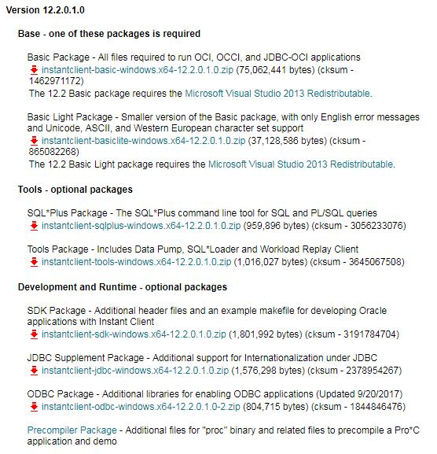

## 前言

因为工作需要，需要连接oracle，但是oracle客户端实在太大， 安装步骤也比较麻烦，Instant Client 解压就可用，基本的本地连接和Oracle工具比如SQL Plus都可以用，所以果断选择了Oracle Instant Client。

## Oracle Instant Client 介绍

免费，轻量且易于安装的Oracle数据库工具，库和SDK，用于构建和连接Oracle数据库实例的应用程序。

* Instant Client使应用程序能够连接到本地或远程Oracle数据库以进行开发和生产部署。
* Instant Client库提供必要的网络连接以及基本和高端数据功能，以充分利用Oracle数据库。
* 它是流行语言和环境的Oracle API的基础，包括Node.js，Python和PHP，以及为OCI，OCCI，JDBC，ODBC和Pro * C应用程序提供访问。
* Instant Client中包含的工具（如SQL Plus和Oracle Data Pump）提供快速方便的数据访问。

## 安装

### 下载 Instant Client 压缩包

到 [Oracle Instant Client 下载链接](http://www.oracle.com/technetwork/database/database-technologies/instant-client/downloads/index.html) 选择对应的版本下载。在下载页面中，还有可选的SQL*Plus 包和工具包，可按自己选择下载。解压到某一目录下，例如:C:\oracle\instantclient_12_2。把解压目录C:\oracle\instantclient_12_2 添加到环境变量 **PATH** 中


### 配置 tnsnames.ora

在C:\oracle\instantclient_12_2目录下创建子文件夹network\admin，绝对路径也就是C:\oracle\instantclient_12_2\network\admin，在该目录下新建文件tnsnames.ora。然后添加环境变量**TNS_ADMIN**，值为tnsnames.ora文件所在路径。

**tnsnames.ora**

```
orcl =
  (DESCRIPTION =
    (ADDRESS_LIST =
      (ADDRESS = (PROTOCOL = TCP)(HOST = xx.xx.xx.xx)(PORT = 1521))
    )
    (CONNECT_DATA =
      (SERVICE_NAME = orcl)
    )
  )
```

### 设置环境变量

| 变量名    |                                     变量值 |                说明                 |
|-----------|-------------------------------------------:|:-----------------------------------:|
| Path      |              C:\oracle\instantclient_12_2; | 在Path后面追加instantclient解压路径 |
| TNS_ADMIN | C:\oracle\instantclient_12_2\network\admin |        tnsnames.ora所在路径         |
| NLS_LANG  |          SIMPLIFIED CHINESE_CHINA.ZHS16GBK |        设置Oracle字符语言集         |

如果不清楚远程数据库的ORACLE 语言，可以ssh或者telnet到远程机器,在命令界面输入，用命令行连接到数据库，查看NLS_LANGUAGE 的值。

``` sql
select * from nls_instance_parameters;
```

## 结语

按上面步骤完成后，PL/SQL Developer即可安装使用，不用做任何配置，非常方便。


