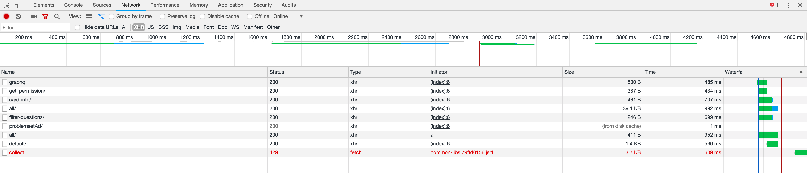

## 前言

最近在刷算法题，想要整理一下做个总结，发现每道题都要复制粘贴题目和解法实在太浪费时间了。本着解放劳动力的思维研究了下Leetcode 爬虫，把题目和代码爬取自动生成 Markdown 文档。我已经把项目提交到了 github 上了，欢迎大家 star fork。

在这里贴的代码为了方便理解，在源码上做了些改动。

## 模拟登陆 Leetcdoe

### 代码

``` python
import requests,json
from requests_toolbelt import MultipartEncoder

session = requests.Session()
user_agent = r'Mozilla/5.0 (Windows NT 6.1; WOW64) AppleWebKit/537.36 (KHTML, like Gecko) Chrome/44.0.2403.157 Safari/537.36'

def login(username, password):
    url = 'https://leetcode.com'
    cookies = session.get(url).cookies
    for cookie in cookies:
        if cookie.name == 'csrftoken':
            csrftoken = cookie.value

    url = "https://leetcode.com/accounts/login"
        
    params_data = {
        'csrfmiddlewaretoken': csrftoken,
        'login': username,
        'password':password,
        'next': 'problems'
    }
    headers = {'User-Agent': user_agent, 'Connection': 'keep-alive', 'Referer': 'https://leetcode.com/accounts/login/', "origin": "https://leetcode.com"}
    m = MultipartEncoder(params_data)   

    headers['Content-Type'] = m.content_type
    session.post(url, headers = headers, data = m, timeout = 10, allow_redirects = False)
    is_login = session.cookies.get('LEETCODE_SESSION') != None
    return is_login
```

## 爬取题目

### 获取所有题目信息

#### 页面分析

要做一个爬虫，先得了解页面逻辑。如果有现成的接口可以直接调用，获取到想要的数据，就模拟调用接口得到数据。

我们用 chrome 按 F12 打开调试，选 NETWORK，打开[题目页面](https://leetcode.com/problemset/all/)。

过滤只查看 XHR，界面如下：



可以发现 https://leetcode.com/api/problems/all/ 这个接口即为获取所有题目的接口。通过解析里面的数据可以得到所有题目的名称、编号、难度等。

#### 代码

``` python
import requests,json

session = requests.Session()
user_agent = r'Mozilla/5.0 (Windows NT 6.1; WOW64) AppleWebKit/537.36 (KHTML, like Gecko) Chrome/44.0.2403.157 Safari/537.36'

def get_problems():
    url = "https://leetcode.com/api/problems/all/"

    headers = {'User-Agent': user_agent, 'Connection': 'keep-alive'}
    resp = session.get(url, headers = headers, timeout = 10)
       
    question_list = json.loads(resp.content.decode('utf-8'))

    for question in question_list['stat_status_pairs']:
        # 题目编号
        question_id = question['stat']['question_id']
        # 题目名称
        question_slug = question['stat']['question__title_slug']
        # 题目状态
        question_status = question['status']

        # 题目难度级别，1 为简单，2 为中等，3 为困难
        level = question['difficulty']['level']

        # 是否为付费题目
        if question['paid_only']:
            continue
```

### 爬取某道题的详细信息

### 页面分析

#### 代码

``` python
import requests,json

session = requests.Session()
user_agent = r'Mozilla/5.0 (Windows NT 6.1; WOW64) AppleWebKit/537.36 (KHTML, like Gecko) Chrome/44.0.2403.157 Safari/537.36'

def get_problem_by_slug(slug):
    url = "https://leetcode.com/graphql"
    params = {'operationName': "getQuestionDetail",
        'variables': {'titleSlug': slug},
        'query': '''query getQuestionDetail($titleSlug: String!) {
            question(titleSlug: $titleSlug) {
                questionId
                questionFrontendId
                questionTitle
                questionTitleSlug
                content
                difficulty
                stats
                similarQuestions
                categoryTitle
                topicTags {
                        name
                        slug
                }
            }
        }'''
    }

    json_data = json.dumps(params).encode('utf8')
                        
    headers = {'User-Agent': user_agent, 'Connection': 
        'keep-alive', 'Content-Type': 'application/json',
        'Referer': 'https://leetcode.com/problems/' + slug}
    resp = session.post(url, data = json_data, headers = headers, timeout = 10)
    content = resp.json()

    # 题目详细信息
    question = content['data']['question']
    print(question)
```

## 爬取 AC 代码

### 爬取某个题目的提交代码列表

#### 代码

``` python
import requests,json

session = requests.Session()
user_agent = r'Mozilla/5.0 (Windows NT 6.1; WOW64) AppleWebKit/537.36 (KHTML, like Gecko) Chrome/44.0.2403.157 Safari/537.36'

def get_submissions(slug):
    url = "https://leetcode.com/graphql"
    params = {'operationName': "Submissions",
        'variables':{"offset":0, "limit":20, "lastKey": '', "questionSlug": slug},
            'query': '''query Submissions($offset: Int!, $limit: Int!, $lastKey: String, $questionSlug: String!) {
                submissionList(offset: $offset, limit: $limit, lastKey: $lastKey, questionSlug: $questionSlug) {
                lastKey
                hasNext
                submissions {
                    id
                    statusDisplay
                    lang
                    runtime
                    timestamp
                    url
                    isPending
                    __typename
                }
                __typename
            }
        }'''
    }

    json_data = json.dumps(params).encode('utf8')

    headers = {'User-Agent': user_agent, 'Connection': 'keep-alive', 'Referer': 'https://leetcode.com/accounts/login/',
        "Content-Type": "application/json"}  
    resp = session.post(url, data = json_data, headers = headers, timeout = 10)
    content = resp.json()
    for submission in content['data']['submissionList']['submissions']:
        print(submission)
```

### 获取某次提交代码

#### 代码

``` python
import requests,json,re

session = requests.Session()
user_agent = r'Mozilla/5.0 (Windows NT 6.1; WOW64) AppleWebKit/537.36 (KHTML, like Gecko) Chrome/44.0.2403.157 Safari/537.36'

def get_submission_by_id(submission_id):
    url = "https://leetcode.com/submissions/detail/" + submission_id
    headers = {'User-Agent': user_agent, 'Connection': 'keep-alive', "Content-Type": "application/json"}
    code_content = session.get(url, headers = headers, timeout = 10)

    pattern = re.compile(r'submissionCode: \'(?P<code>.*)\',\n  editCodeUrl', re.S)
    m1 = pattern.search(code_content.text)
    code = m1.groupdict()['code'] if m1 else None
    print(code)
```


## 全部代码

``` python
import requests,json,re
from requests_toolbelt import MultipartEncoder

session = requests.Session()
user_agent = r'Mozilla/5.0 (Windows NT 6.1; WOW64) AppleWebKit/537.36 (KHTML, like Gecko) Chrome/44.0.2403.157 Safari/537.36'


def login(username, password):
    url = 'https://leetcode.com'
    cookies = session.get(url).cookies
    for cookie in cookies:
        if cookie.name == 'csrftoken':
            csrftoken = cookie.value

    url = "https://leetcode.com/accounts/login"
        
    params_data = {
        'csrfmiddlewaretoken': csrftoken,
        'login': username,
        'password':password,
        'next': 'problems'
    }
    headers = {'User-Agent': user_agent, 'Connection': 'keep-alive', 'Referer':         'https://leetcode.com/accounts/login/',
        "origin": "https://leetcode.com"}
    m = MultipartEncoder(params_data)   

    headers['Content-Type'] = m.content_type
    session.post(url, headers = headers, data = m, timeout = 10, allow_redirects = False)
    is_login = session.cookies.get('LEETCODE_SESSION') != None
    return is_login

def get_problems():
    url = "https://leetcode.com/api/problems/all/"

    
    headers = {'User-Agent': user_agent, 'Connection': 'keep-alive'}
    resp = session.get(url, headers = headers, timeout = 10)
       
    question_list = json.loads(resp.content.decode('utf-8'))

    for question in question_list['stat_status_pairs']:
        # 题目编号
        question_id = question['stat']['question_id']
        # 题目名称
        question_slug = question['stat']['question__title_slug']
        # 题目状态
        question_status = question['status']

        # 题目难度级别，1 为简单，2 为中等，3 为困难
        level = question['difficulty']['level']

        # 是否为付费题目
        if question['paid_only']:
            continue
        print(question_slug)      

def get_problem_by_slug(slug):
    url = "https://leetcode.com/graphql"
    params = {'operationName': "getQuestionDetail",
        'variables': {'titleSlug': slug},
        'query': '''query getQuestionDetail($titleSlug: String!) {
            question(titleSlug: $titleSlug) {
                questionId
                questionFrontendId
                questionTitle
                questionTitleSlug
                content
                difficulty
                stats
                similarQuestions
                categoryTitle
                topicTags {
                        name
                        slug
                }
            }
        }'''
    }

    json_data = json.dumps(params).encode('utf8')
                        
    headers = {'User-Agent': user_agent, 'Connection': 
        'keep-alive', 'Content-Type': 'application/json',
        'Referer': 'https://leetcode.com/problems/' + slug}
    resp = session.post(url, data = json_data, headers = headers, timeout = 10)
    content = resp.json()

    # 题目详细信息
    question = content['data']['question']
    print(question)

def get_submissions(slug):
    url = "https://leetcode.com/graphql"
    params = {'operationName': "Submissions",
        'variables':{"offset":0, "limit":20, "lastKey": '', "questionSlug": slug},
            'query': '''query Submissions($offset: Int!, $limit: Int!, $lastKey: String, $questionSlug: String!) {
                submissionList(offset: $offset, limit: $limit, lastKey: $lastKey, questionSlug: $questionSlug) {
                lastKey
                hasNext
                submissions {
                    id
                    statusDisplay
                    lang
                    runtime
                    timestamp
                    url
                    isPending
                    __typename
                }
                __typename
            }
        }'''
    }

    json_data = json.dumps(params).encode('utf8')

    headers = {'User-Agent': user_agent, 'Connection': 'keep-alive', 'Referer': 'https://leetcode.com/accounts/login/',
        "Content-Type": "application/json"}  
    resp = session.post(url, data = json_data, headers = headers, timeout = 10)
    content = resp.json()
    for submission in content['data']['submissionList']['submissions']:
        print(submission)

def get_submission_by_id(submission_id):
    url = "https://leetcode.com/submissions/detail/" + submission_id
    headers = {'User-Agent': user_agent, 'Connection': 'keep-alive', "Content-Type": "application/json"}
    code_content = session.get(url, headers = headers, timeout = 10)

    pattern = re.compile(r'submissionCode: \'(?P<code>.*)\',\n  editCodeUrl', re.S)
    m1 = pattern.search(code_content.text)
    code = m1.groupdict()['code'] if m1 else None
    print(code)

print(login('u', 'p'))
# get_problems()
# get_problem_by_slug('two-sum')
get_submissions('two-sum')
get_submission_by_id('')
```