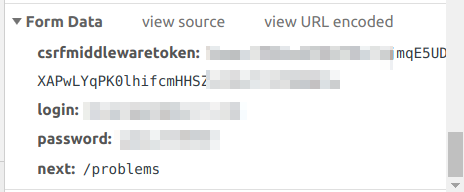
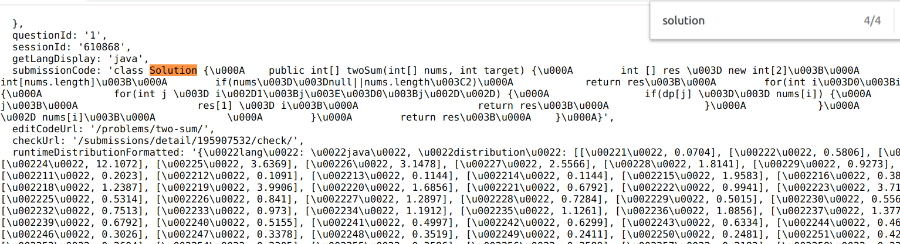

## 前言

最近在刷算法题，想要整理一下做个总结，发现每道题都要复制粘贴题目和解法实在太浪费时间了。本着解放劳动力的思维研究了下 LeetCode 爬虫，把题目和代码爬取自动生成 Markdown 文档。我已经把项目提交到了 github 上了，欢迎大家 star、fork。

[项目源码](https://github.com/gcyml/leetcode-crawler)

在这里贴的代码为了方便理解，在源码上做了些改动。

## 模拟登陆 LeetCdoe

### 页面分析

要做一个爬虫，先得了解页面逻辑。如果有现成的接口可以直接调用，获取到想要的数据，就模拟调用接口得到数据。

在这里就以模拟登陆 LeetCode 为例。首先我们用 Chrome 打开[登陆页面](https://leetcode.com/accounts/login/)，F12 打开调试功能，分析 LeetCode 登陆账号逻辑。

填写账号密码，点击登陆，分析账号信息是如何提交上去的。（**注：由于登陆成功后页面会默认跳转，在 Chrome 中会把之前页面的请求数据历史记录清空，需要勾选 network 下的 Preserve log，保持历史记录**）。

通过查找记录可以发现通过 https://leetcode.com/accounts/login 接口提交了账号信息，这是常见的通过 RESTful 提交数据实现登陆方式。所以我们接下来就是模拟浏览器提交表单数据到这一接口中。



表单中共存放了四对数据，我们需要一一伪造出来。其中有一个名为 csrfmiddlewaretoken 的数据，这个是由 LeetCode 生成放到 cookie 中的。在模拟登陆之前，需要通过访问 LeetCode 主页，取得该 Cookie 值而后填充到我们的表单中。

由于需要维持登陆状态，这里是用了 requests 中的会话对象 Session，下面是 [Requests 官方文档](http://docs.python-requests.org/zh_CN/latest/user/advanced.html)中关于 Session 的介绍。

>会话对象让你能够跨请求保持某些参数。它也会在同一个 Session 实例发出的所有请求之间保持 cookie， 期间使用 urllib3 的 connection pooling 功能。所以如果你向同一主机发送多个请求，底层的 TCP 连接将会被重用，从而带来显著的性能提升。 (参见 HTTP persistent connection).

伪造完表单数据，还需要伪造表头，部分反爬虫逻辑就是通过表头中的数据来分辨爬虫，如 User-Agent 中记录了你所使用的浏览器类型及版本、操作系统及版本、浏览器内核、等信息的标识。Requests 中默认的 User-Agent 是 Python-requests/\**.**，如果不伪造很可能会被反爬机制拦截。

这里我们就照着自己计算机中的参数进行伪造就可以了，请求 header可以在 Request Header中找到（注：不一定要完全，只选取其中比较特殊的字段即可）

伪造完数据，提交表单即可。由于登陆成功会自动跳转，需要在 post 方法中设置 allow_redirects 为 Fasle 禁止跳转，避免不必要的跳转。

### 代码

``` python
import requests,json
from requests_toolbelt import MultipartEncoder

session = requests.Session()
user_agent = r'Mozilla/5.0 (Windows NT 6.1; WOW64) AppleWebKit/537.36 (KHTML, like Gecko) Chrome/44.0.2403.157 Safari/537.36'

def login(username, password):
    url = 'https://leetcode.com'
    cookies = session.get(url).cookies
    for cookie in cookies:
        if cookie.name == 'csrftoken':
            csrftoken = cookie.value

    url = "https://leetcode.com/accounts/login"
        
    params_data = {
        'csrfmiddlewaretoken': csrftoken,
        'login': username,
        'password':password,
        'next': 'problems'
    }
    headers = {'User-Agent': user_agent, 'Connection': 'keep-alive', 'Referer': 'https://leetcode.com/accounts/login/', "origin": "https://leetcode.com"}
    m = MultipartEncoder(params_data)   

    headers['Content-Type'] = m.content_type
    session.post(url, headers = headers, data = m, timeout = 10, allow_redirects = False)
    is_login = session.cookies.get('LEETCODE_SESSION') != None
    return is_login
```

## 爬取题目

### 获取所有题目信息

#### 页面分析

打开题目列表页面，调试发现 https://leetcode.com/api/problems/all/ 这个接口即为获取所有题目的接口。获取解析里面的数据便可以得到所有题的名称、编号、难度等。这里的接口中并不能获取到题目的详细问题说明，需要再往下分析。

#### 代码

``` python
import requests,json

session = requests.Session()
user_agent = r'Mozilla/5.0 (Windows NT 6.1; WOW64) AppleWebKit/537.36 (KHTML, like Gecko) Chrome/44.0.2403.157 Safari/537.36'

def get_problems():
    url = "https://leetcode.com/api/problems/all/"

    headers = {'User-Agent': user_agent, 'Connection': 'keep-alive'}
    resp = session.get(url, headers = headers, timeout = 10)
       
    question_list = json.loads(resp.content.decode('utf-8'))

    for question in question_list['stat_status_pairs']:
        # 题目编号
        question_id = question['stat']['question_id']
        # 题目名称
        question_slug = question['stat']['question__title_slug']
        # 题目状态
        question_status = question['status']

        # 题目难度级别，1 为简单，2 为中等，3 为困难
        level = question['difficulty']['level']

        # 是否为付费题目
        if question['paid_only']:
            continue
```

### 爬取某道题的详细信息

### 页面分析

打开某道题的页面，分析是否有请求题目的接口（解析页面源码取得数据的方式效率比较低，不优先使用）。

在题目页面中，有几条链接均为 `https://leetcode.com/graphql` 的请求，其中一条即为请求题目详细信息。

这里引出了一个新概念： `GarphQL`。

下面摘抄自以[LeetCode为例——如何发送GraphQL Query获取数据](https://blog.csdn.net/qq_42564846/article/details/81127469)。

>GraphQL 是一种用于 API 的查询语言，是由 Facebook 开源的一种用于提供数据查询服务的抽象框架。在服务端 API 开发中，很多时候定义一个接口返回的数据相对固定，因此要获得更多信息或者只想得到某部分信息时，基于 RESTful API 的接口就显得不那么灵活。而 GraphQL 对 API 中的数据提供了一套易于理解的完整描述，使得客户端能够准确地获得它需要的数据，而且没有任何冗余，也让 API 更容易地随着时间推移而演进，还能用于构建强大的开发者工具。

现在 LeetCode 的大部分接口都是通过 GraphQL 来获取。这里关于 GraphQL 不做深层次的了解，大致就是通过类似 SQL 的查询语言来实现一对多的接口。我们直接复制获取题目详细信息的查询语句来实现目的。

#### 代码

``` python
import requests,json

session = requests.Session()
user_agent = r'Mozilla/5.0 (Windows NT 6.1; WOW64) AppleWebKit/537.36 (KHTML, like Gecko) Chrome/44.0.2403.157 Safari/537.36'

def get_problem_by_slug(slug):
    url = "https://leetcode.com/graphql"
    params = {'operationName': "getQuestionDetail",
        'variables': {'titleSlug': slug},
        'query': '''query getQuestionDetail($titleSlug: String!) {
            question(titleSlug: $titleSlug) {
                questionId
                questionFrontendId
                questionTitle
                questionTitleSlug
                content
                difficulty
                stats
                similarQuestions
                categoryTitle
                topicTags {
                        name
                        slug
                }
            }
        }'''
    }

    json_data = json.dumps(params).encode('utf8')
                        
    headers = {'User-Agent': user_agent, 'Connection': 
        'keep-alive', 'Content-Type': 'application/json',
        'Referer': 'https://leetcode.com/problems/' + slug}
    resp = session.post(url, data = json_data, headers = headers, timeout = 10)
    content = resp.json()

    # 题目详细信息
    question = content['data']['question']
    print(question)
```

## 爬取最新 AC 代码

要获取 AC 代码，必须得先为登陆状态，下面代码均为在假设 session 已登陆的假定条件下。

### 爬取某个题目的提交代码列表

#### 页面分析

LeetCode 现在有新版和旧版布局，旧版中没有查到相关的请求，不过在新版中用 GraphQL 请求了当前账户的提交代码清单。其中记录了所有提交代码的编号、编程语言、时间戳、状态等信息，但并没有带有代码，需要再往下一层分析。

#### 代码

``` python
import requests,json

session = requests.Session()
user_agent = r'Mozilla/5.0 (Windows NT 6.1; WOW64) AppleWebKit/537.36 (KHTML, like Gecko) Chrome/44.0.2403.157 Safari/537.36'

def get_submissions(slug):
    url = "https://leetcode.com/graphql"
    params = {'operationName': "Submissions",
        'variables':{"offset":0, "limit":20, "lastKey": '', "questionSlug": slug},
            'query': '''query Submissions($offset: Int!, $limit: Int!, $lastKey: String, $questionSlug: String!) {
                submissionList(offset: $offset, limit: $limit, lastKey: $lastKey, questionSlug: $questionSlug) {
                lastKey
                hasNext
                submissions {
                    id
                    statusDisplay
                    lang
                    runtime
                    timestamp
                    url
                    isPending
                    __typename
                }
                __typename
            }
        }'''
    }

    json_data = json.dumps(params).encode('utf8')

    headers = {'User-Agent': user_agent, 'Connection': 'keep-alive', 'Referer': 'https://leetcode.com/accounts/login/',
        "Content-Type": "application/json"}  
    resp = session.post(url, data = json_data, headers = headers, timeout = 10)
    content = resp.json()
    for submission in content['data']['submissionList']['submissions']:
        print(submission)
```

### 获取某次提交代码

#### 页面分析

打开某次提交代码的页面，其链接格式如 https://leetcode.com/submissions/detail/123456789/， 后面对应的数字为每次提交代码的 id。

前面我们已经可以获取到所有的提交代码的简略信息，找出最新的 AC 代码的编号，取得页面源代码。

对页面分析发现这里并没有调用请求数据，数据应该是随页面渲染而成，因此我们只能通过传统的获取页面源码正则解析的方式。

用 Chrome 查看网页源代码，发现代码被赋予到一个 submissionCode 的变量中去了。



#### 代码

``` python
import requests,json,re

session = requests.Session()
user_agent = r'Mozilla/5.0 (Windows NT 6.1; WOW64) AppleWebKit/537.36 (KHTML, like Gecko) Chrome/44.0.2403.157 Safari/537.36'

def get_submission_by_id(submission_id):
    url = "https://leetcode.com/submissions/detail/" + submission_id
    headers = {'User-Agent': user_agent, 'Connection': 'keep-alive', "Content-Type": "application/json"}
    code_content = session.get(url, headers = headers, timeout = 10)

    pattern = re.compile(r'submissionCode: \'(?P<code>.*)\',\n  editCodeUrl', re.S)
    m1 = pattern.search(code_content.text)
    code = m1.groupdict()['code'] if m1 else None
    print(code)
```


## 全部代码

``` python
import requests,json,re
from requests_toolbelt import MultipartEncoder

session = requests.Session()
user_agent = r'Mozilla/5.0 (Windows NT 6.1; WOW64) AppleWebKit/537.36 (KHTML, like Gecko) Chrome/44.0.2403.157 Safari/537.36'


def login(username, password):
    url = 'https://leetcode.com'
    cookies = session.get(url).cookies
    for cookie in cookies:
        if cookie.name == 'csrftoken':
            csrftoken = cookie.value

    url = "https://leetcode.com/accounts/login"
        
    params_data = {
        'csrfmiddlewaretoken': csrftoken,
        'login': username,
        'password':password,
        'next': 'problems'
    }
    headers = {'User-Agent': user_agent, 'Connection': 'keep-alive', 'Referer':         'https://leetcode.com/accounts/login/',
        "origin": "https://leetcode.com"}
    m = MultipartEncoder(params_data)   

    headers['Content-Type'] = m.content_type
    session.post(url, headers = headers, data = m, timeout = 10, allow_redirects = False)
    is_login = session.cookies.get('LEETCODE_SESSION') != None
    return is_login

def get_problems():
    url = "https://leetcode.com/api/problems/all/"

    
    headers = {'User-Agent': user_agent, 'Connection': 'keep-alive'}
    resp = session.get(url, headers = headers, timeout = 10)
       
    question_list = json.loads(resp.content.decode('utf-8'))

    for question in question_list['stat_status_pairs']:
        # 题目编号
        question_id = question['stat']['question_id']
        # 题目名称
        question_slug = question['stat']['question__title_slug']
        # 题目状态
        question_status = question['status']

        # 题目难度级别，1 为简单，2 为中等，3 为困难
        level = question['difficulty']['level']

        # 是否为付费题目
        if question['paid_only']:
            continue
        print(question_slug)      

def get_problem_by_slug(slug):
    url = "https://leetcode.com/graphql"
    params = {'operationName': "getQuestionDetail",
        'variables': {'titleSlug': slug},
        'query': '''query getQuestionDetail($titleSlug: String!) {
            question(titleSlug: $titleSlug) {
                questionId
                questionFrontendId
                questionTitle
                questionTitleSlug
                content
                difficulty
                stats
                similarQuestions
                categoryTitle
                topicTags {
                        name
                        slug
                }
            }
        }'''
    }

    json_data = json.dumps(params).encode('utf8')
                        
    headers = {'User-Agent': user_agent, 'Connection': 
        'keep-alive', 'Content-Type': 'application/json',
        'Referer': 'https://leetcode.com/problems/' + slug}
    resp = session.post(url, data = json_data, headers = headers, timeout = 10)
    content = resp.json()

    # 题目详细信息
    question = content['data']['question']
    print(question)

def get_submissions(slug):
    url = "https://leetcode.com/graphql"
    params = {'operationName': "Submissions",
        'variables':{"offset":0, "limit":20, "lastKey": '', "questionSlug": slug},
            'query': '''query Submissions($offset: Int!, $limit: Int!, $lastKey: String, $questionSlug: String!) {
                submissionList(offset: $offset, limit: $limit, lastKey: $lastKey, questionSlug: $questionSlug) {
                lastKey
                hasNext
                submissions {
                    id
                    statusDisplay
                    lang
                    runtime
                    timestamp
                    url
                    isPending
                    __typename
                }
                __typename
            }
        }'''
    }

    json_data = json.dumps(params).encode('utf8')

    headers = {'User-Agent': user_agent, 'Connection': 'keep-alive', 'Referer': 'https://leetcode.com/accounts/login/',
        "Content-Type": "application/json"}  
    resp = session.post(url, data = json_data, headers = headers, timeout = 10)
    content = resp.json()
    for submission in content['data']['submissionList']['submissions']:
        print(submission)

def get_submission_by_id(submission_id):
    url = "https://leetcode.com/submissions/detail/" + submission_id
    headers = {'User-Agent': user_agent, 'Connection': 'keep-alive', "Content-Type": "application/json"}
    code_content = session.get(url, headers = headers, timeout = 10)

    pattern = re.compile(r'submissionCode: \'(?P<code>.*)\',\n  editCodeUrl', re.S)
    m1 = pattern.search(code_content.text)
    code = m1.groupdict()['code'] if m1 else None
    print(code)

print(login('u', 'p'))
# get_problems()
# get_problem_by_slug('two-sum')
get_submissions('two-sum')
get_submission_by_id('')
```